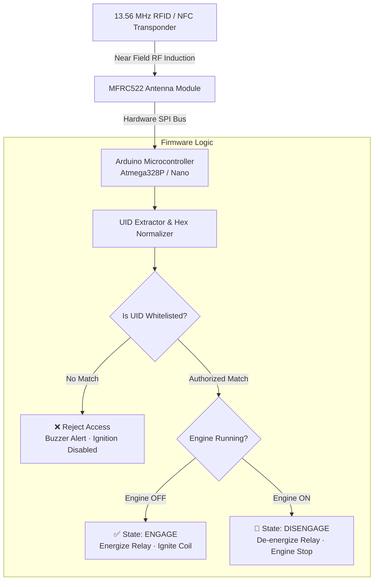

<div align="center">

# 🔐 RFID-Based Smart Car Ignition Security System

### Embedded NFC/RFID Access Control Engine with Hardware SPI & Relay Actuation

[](https://www.arduino.cc/)
[](https://www.arduino.cc/)
[](LICENSE)

<p align="center">
  
  
  
  
</p>

*An embedded automotive security system that replaces vulnerable mechanical key ignitions with encrypted cryptographic UID card authentication via an MFRC522 high-frequency transceiver.*

</div>

---

## 🌟 System Highlights

- 🔒 **Cryptographic UID Filtering:** Validates incoming card identification numbers against stored memory whitelist registers before firing ignition triggers.
- ⚡ **Zero-Latency SPI Interfacing:** Hardware Serial Peripheral Interface (SPI) delivers millisecond contactless scan speeds at 13.56 MHz.
- 🔄 **Stateful Bistable Ignition:** Single-tap to crank and engage ignition coil; secondary tap to execute clean engine power down.
- 🛡️ **Galvanic Isolation:** 5V optocoupled relay circuit prevents automotive voltage spikes and alternator feedback from reaching the microcontroller.

---

## 🏗️ Hardware Architecture & State Machine



---

## ⚡ Pinout Mapping Table

| MFRC522 Pin | Arduino Microcontroller Pin | Signal Description |
|:---:|:---:|:---|
| **SDA (SS)** | `Pin 10` | SPI Slave Select |
| **SCK** | `Pin 13` | SPI Bus Serial Clock |
| **MOSI** | `Pin 11` | Master Out Slave In |
| **MISO** | `Pin 12` | Master In Slave Out |
| **IRQ** | `Unused` | Interrupt Request |
| **GND** | `GND` | Common Ground Plane |
| **RST** | `Pin 9` | Module Reset Trigger |
| **3.3V** | `3.3V` | Transceiver Power Rail (⚠️ Do NOT use 5V) |
| **Relay Signal** | `Pin 4` | Active-Low / Active-High Control Signal |

---

## 🚀 Quick Setup Guide

### 1. Hardware Connections
1. Wire the **MFRC522** reader module to the Arduino using the pinout table above.
2. Connect the relay input pin to `Digital Pin 4`, and route the vehicle ignition wire through the relay **Normally Open (NO)** contact.

### 2. Firmware Flashing
```bash
git clone https://github.com/Izumi6/RFID-Based-Car-Ignition-System.git
```
1. Open `rfid_car_ignition.ino` inside the Arduino IDE.
2. Install the official `MFRC522` library via `Tools → Manage Libraries`.
3. Run `read_rfid_uid.ino` once to identify your NFC card's unique 4-byte or 7-byte UID.
4. Paste your UID into `authorizedUID` in `rfid_car_ignition.ino` and upload to your board.

---

## 🛠️ Hardware & Components

- **Microcontroller:** Arduino Uno / Nano (Atmega328P)
- **RF Module:** NXP MFRC522 (13.56 MHz RFID/NFC)
- **Relay:** 5V 10A Optocoupled Single-Channel Relay
- **Indicator:** Bi-color Status LEDs + Piezo Buzzer

---

## 👤 Author

**Suyash Vakhariya**  
*AI Engineer & Systems Builder*  
- **Portfolio:** [suyashvakhariya.com](https://suyashvakhariya.com)  
- **LinkedIn:** [linkedin.com/in/suyashvakhariya](https://www.linkedin.com/in/suyashvakhariya)  
- **GitHub:** [@Izumi6](https://github.com/Izumi6)  

---

## 📄 License

This project is licensed under the [MIT License](LICENSE).
